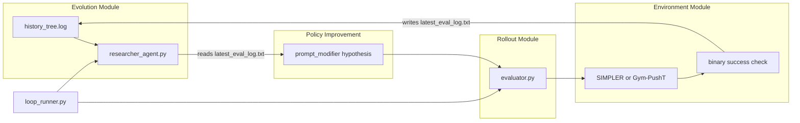

# ENPIRE VLA Autoresearch MVP

A minimal **agentic autoresearch loop** for optimizing open-source Vision-Language-Action (VLA) models in simulation, inspired by [ENPIRE: Agentic Robot Policy Self-Improvement in the Real World](https://research.nvidia.com/labs/gear/enpire/).

An LLM acts as the **Researcher**: it reads evaluation logs, proposes a prompt modifier, runs a fast simulation rollout, and appends results to a local idea tree.

## Architecture



## ENPIRE Module Mapping

| ENPIRE Module | MVP Component | MVP behavior | Future upgrade |
|---|---|---|---|
| **EN** (Environment) | `src/evaluator.py` env wrapper | `env.reset()`, binary success from sim state | Perception tools (SAM/YOLO) for pixel-based verify |
| **R** (Rollout) | `src/evaluator.py` episode loop | N episodes, log steps + success | Parallel rollouts, video saving |
| **PI** (Policy Improvement) | `src/researcher_agent.py` | Prompt modifier generation | LoRA training config edits, data sampler tuning |
| **E** (Evolution) | `src/loop_runner.py` + `logs/history_tree.log` | Append-only experiment log, LLM reads history | Git-branch idea tree, prune bad runs, multi-agent |

## Repository Layout

```
enpire-vla-autoresearch/
├── config/default.yaml       # task, loop, env, vla, llm settings
├── src/
│   ├── loop_runner.py        # orchestrator
│   ├── researcher_agent.py   # LLM evolution (PI + E)
│   ├── evaluator.py          # env + rollout (EN + R)
│   ├── env/                  # PushT and SIMPLER wrappers
│   └── vla/                  # mock, OpenVLA, Octo adapters
├── logs/                     # runtime output (gitignored)
└── scripts/                  # setup helpers
```

## Quick Start (Mac, ~2 min)

No GPU required. Uses **Gym-PushT** + **mock VLA** to validate the full loop.

```bash
cd enpire-vla-autoresearch
bash scripts/setup_mac.sh
source .venv/bin/activate

# Validate loop without LLM API calls
python -m src.loop_runner --dry-run
```

Review output in:
- `logs/latest_eval_log.txt` — most recent experiment
- `logs/history_tree.log` — full idea tree
- `logs/best_run.json` — best modifier so far

## Full Loop with LLM Researcher

```bash
cp .env.example .env
# Add your OPENAI_API_KEY to .env

python -m src.loop_runner
```

Or run components individually:

```bash
python -m src.researcher_agent          # proposes next modifier
python -m src.evaluator --modifier "carefully focusing on the handle"
```

## GPU Path: SIMPLER + OpenVLA

For the real VLA experiments (e.g. "pick up the red mug"), use an NVIDIA GPU (T4/3090+).

```bash
bash scripts/setup_gpu.sh
pip install flash-attn==2.6.1 --no-build-isolation

git clone https://github.com/simpler-env/SimplerEnv ../SimplerEnv
cd ../SimplerEnv && pip install -e .
```

Set in `.env`:

```bash
VLA_BACKEND=openvla
ENV_BACKEND=simpler
OPENAI_API_KEY=sk-...
```

Update `config/default.yaml` if needed, then:

```bash
python -m src.loop_runner
```

**Memory note:** OpenVLA-7B needs ~1×3090. Run only one env + one inference process at a time.

## Configuration

Edit [`config/default.yaml`](config/default.yaml):

```yaml
task:
  base_instruction: "pick up the red mug"
  episodes: 5
loop:
  iterations: 5
env:
  backend: pusht          # pusht | simpler
vla:
  backend: mock           # mock | openvla | octo
llm:
  provider: openai        # openai | anthropic
  model: gpt-4o-mini
```

Environment variables in `.env` override `env.backend` and `vla.backend`.

## Two-Track Setup

| Track | Environment | VLA | Hardware |
|---|---|---|---|
| **Dev** | Gym-PushT | mock | Mac / CPU |
| **Research** | SIMPLER | OpenVLA-7B | NVIDIA GPU |

## Roadmap

- [ ] LoRA fine-tuning instead of prompt-only optimization
- [ ] Octo-small adapter (scaffold included)
- [ ] Idea-tree visualization (ENPIRE-style git tree)
- [ ] RoboCasa simulation tasks
- [ ] Multi-agent parallel branches
- [ ] MRU / MTU resource utilization metrics

## References

- [ENPIRE paper & demo](https://research.nvidia.com/labs/gear/enpire/)
- [Gym-PushT](https://github.com/huggingface/gym-pusht)
- [SIMPLER](https://github.com/simpler-env/SimplerEnv)
- [OpenVLA](https://github.com/openvla/openvla)
- [Octo](https://github.com/octo-models/octo)

## License

MIT
